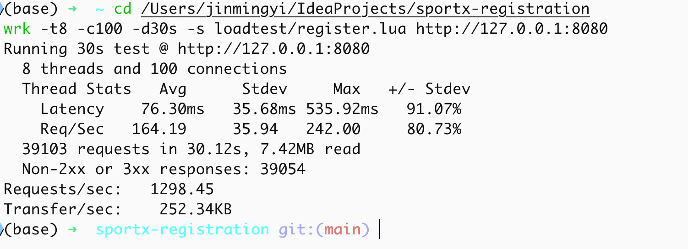
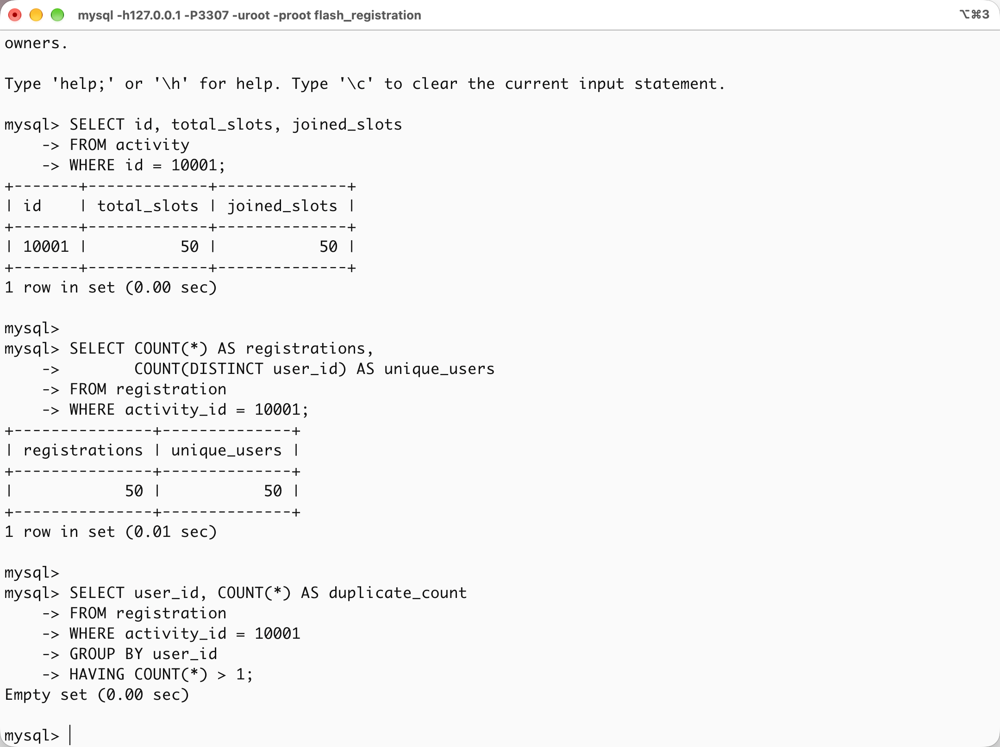
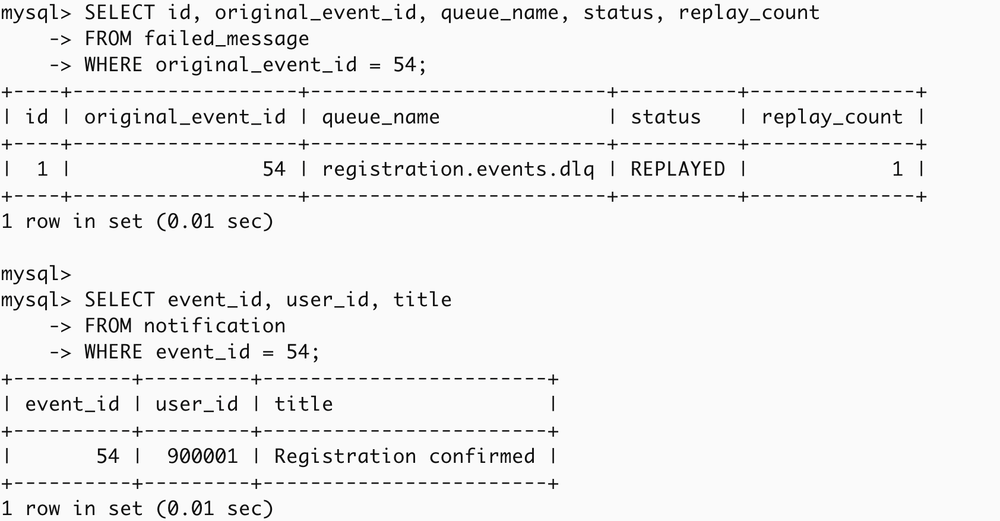

# SportX 高并发活动报名

这是为技术任务独立实现的高并发限量报名服务。项目聚焦报名、可靠事件投递和失败恢复链路，以可复现压测验证并发安全与消息可靠性。

## 功能范围

- 用户报名限量活动。
- 在高并发下防止超卖和重复报名。
- 使用 Transactional Outbox 保证业务提交与事件投递的一致性。
- 通过 RabbitMQ 异步处理报名成功通知，并开启 Publisher Confirm。
- 消费端幂等、指数退避重试、死信队列、失败消息落库与手动回放。

## 方案思路

系统将一次报名拆成同步事务和异步事件两个阶段：同步阶段只负责确保名额和报名记录正确，异步阶段负责通知等可延迟副作用。报名请求先经过用户维度的分布式锁降低连点压力，再通过 MySQL 原子条件更新占用名额，最后由数据库唯一索引提供最终重复报名兜底。

报名记录、名额更新和 `outbox_event` 在同一个 MySQL 事务中提交。事务成功后，由独立 Relay 扫描 `PENDING` 事件并投递 RabbitMQ；消费者处理通知时通过 Redis 幂等 Key 和通知表唯一约束抵御重复投递。消费失败经过有限次数的退避重试后进入 DLQ，持久化为 `failed_message`，仅在修复根因后由人工回放。

## 技术选型理由

| 技术 | 选择理由 |
| --- | --- |
| Spring Boot + MyBatis-Plus | 快速搭建分层 REST 服务，保留可读的事务与条件更新代码。 |
| MySQL InnoDB | 用条件 `UPDATE` 与唯一索引作为最终一致性边界，防止名额超卖和重复报名。 |
| Redis + Redisson | `RLock` 处理短时分布式互斥；Redis ZSet + Lua 实现多实例共享的滑动窗口限流。 |
| RabbitMQ | 适合可靠事件通知、消费重试、DLQ 和人工回放这一类业务消息链路。 |
| Transactional Outbox | 避免数据库提交成功后应用宕机导致消息丢失，也避免事务回滚后仍发出幽灵消息。 |
| Docker Compose | 用隔离端口一键启动 MySQL、Redis、RabbitMQ，保证压测环境可复现且不影响原 SportX 环境。 |

## 难点与解决方式

1. **锁不能单独保证正确性**：Redis 锁只能减少同一用户的并发重复进入，不能取代数据库一致性。因此将防超卖交给原子条件更新，将最终防重交给唯一索引。
2. **业务提交与 MQ 投递无法天然处于同一事务**：使用 Outbox 表持久化“待发送意图”，Relay 在提交后异步投递，结合 Publisher Confirm 后才标记 `DELIVERED`。
3. **重试不能造成更大故障**：Outbox 重试使用持久化 `next_retry_at` 实现有限指数退避；消费者重试耗尽进入 DLQ，不自动无限回放。Webhook 告警失败只记录日志，避免 DLQ 消费者因告警服务故障再次循环失败。
4. **压测吞吐与成功报名数不是同一指标**：`wrk` 的总请求吞吐包含活动售罄后的业务拒绝响应，因此最终正确性以 MySQL 的名额、报名数和去重查询为准，而不是将总 `requests/sec` 误称为成功报名 TPS。

## 未完成部分

- 未实现热点详情缓存及逻辑过期、空值占位等缓存防护；该最小系统没有高频详情读取链路，因此没有为了加分虚构缓存场景。
- Webhook 告警已实现为可选配置，但尚未绑定真实飞书、钉钉或企业微信机器人；未配置 `ALERT_WEBHOOK_URL` 时使用结构化 `ERROR` 日志作为本地兜底。
- 没有用户注册、登录和 Token 鉴权；压测通过 `X-User-Id` 模拟独立用户，避免认证流程干扰并发报名验证。
- 当前以 Docker 真实联调和 `wrk` 压测作为验证方式，尚未补充 Testcontainers 自动化集成测试。

## 设计改进

本项目没有扩展无关的业务功能，重点是在既有高并发报名经验上独立重构并提升可靠性设计：

- **Outbox 退避重试**：Relay 将 `next_retry_at` 持久化。投递失败后按 `1s, 2s, 4s, 8s, 16s` 延迟再试，而不是每次定时扫描都立即重试，避免下游故障时形成固定频率的无效请求。
- **Relay 锁安全性**：多实例 Relay 使用 Redisson `RLock` 竞争任务执行权。它支持持锁者校验和可重入语义，避免手写 `SETNX + TTL` 方案中锁过期后旧实例误删新实例锁的风险。
- **可验证的故障恢复**：通过受控消费者异常，真实演示消费重试、DLQ 落库和修复后手动回放，而非只在 README 中描述理论流程。
- **可选 Webhook 告警**：DLQ 消息持久化后，系统向 `ALERT_WEBHOOK_URL` 发送事件摘要；未配置时记录结构化 `ERROR` 日志。告警失败只记录日志，不会触发 DLQ 消费死循环。
- **声明式限流**：通过自定义 `@RateLimit` 与 Spring AOP 为报名接口接入 Redis Lua 滑动窗口；脚本原子完成过期请求清理、窗口计数和请求写入，在多实例下仍严格限制同一用户每秒最多 5 次请求。

## 架构流程

```text
报名请求
  -> Redisson RLock（用户 + 活动，减少重复点击）
  -> MySQL 事务
       -> 原子条件更新占用名额
       -> 写 registration 报名记录
       -> 写 outbox_event 待投递事件
  -> Outbox Relay（每 3 秒扫描，分布式锁）
  -> RabbitMQ Direct Exchange -> 报名事件队列
  -> 幂等消费者 -> notification 通知表
                 -> 重试 -> DLQ -> failed_message -> 手动回放
```

## 报名并发安全

| 层次 | 机制 | 解决的问题 |
| --- | --- | --- |
| 请求层 | Redisson `RLock`，锁粒度为 `activityId:userId` | 减少同一用户连点或并发重复提交造成的无效数据库压力。 |
| 名额层 | 原子条件 SQL 更新 | `UPDATE activity SET joined_slots = joined_slots + 1 WHERE id = ? AND joined_slots < total_slots` 在 InnoDB 行锁内执行，只有存在余量才会成功，防止超卖。 |
| 数据层 | `UNIQUE(user_id, activity_id)` | 最终兜底，保证一个用户无法落两条同一活动的报名记录。 |

Redis 锁不是最终正确性的唯一保障：锁租约可能到期，用户也可能顺序重复请求。因此，原子条件更新和唯一索引才是最终边界。

## 声明式接口限流

报名接口标注了 `@RateLimit(limit = 5, windowSeconds = 1)`。Spring AOP 在 Controller 执行前调用 Redis Lua 脚本，以 `rate_limit:RegistrationController:register:{userId}` 作为 ZSet Key：脚本删除窗口外请求、统计窗口内请求数、记录本次请求三个步骤在 Redis 中原子完成。

选择滑动窗口而非令牌桶，是为了对“任意最近 1 秒最多 5 次请求”提供严格限制；令牌桶更适合允许短时突发、按速率平滑放行的场景。限流状态保存在 Redis，因此多实例部署仍共享同一用户的额度。超过阈值时返回 HTTP `429 Too Many Requests`。


可使用不存在的活动 ID 做无副作用验证，前 5 次会通过限流层并返回业务 `400`，第 6 次返回 `429`：

```bash
for i in 1 2 3 4 5 6; do
  curl -sS -o /dev/null -w "request $i -> HTTP %{http_code}\n" \
    -X POST http://127.0.0.1:8080/activities/99999/registrations \
    -H "X-User-Id: 777777"
done
```

## Transactional Outbox

报名记录、名额占用和一条 `outbox_event(PENDING)` 在同一个 MySQL 事务中提交。

- 数据库提交成功但应用立即崩溃：`outbox_event` 仍留在表中，Relay 重启后会继续投递，不会丢失事件。
- 数据库事务回滚：报名和 Outbox 记录同时回滚，不会产生“幽灵消息”。
- Relay 每 3 秒扫描待发送事件，RabbitMQ 返回 Publisher Confirm ACK 后才把状态更新为 `DELIVERED`。
- 投递失败按 `1s, 2s, 4s, 8s, 16s` 指数退避，最多 5 次；耗尽后状态改为 `FAILED`，等待人工排查。

## MQ 消费可靠性

消费者以 `idem:registration-event:{eventId}` 作为 Redis 幂等 Key，使用 `SETNX` 抢占并设置 7 天 TTL；通知表再通过 `UNIQUE(event_id, user_id)` 提供持久化兜底。

消费者出现临时异常时，会删除本次幂等 Key 并抛出异常，让 Spring AMQP 自动以 `1s, 2s, 4s` 重试。重试耗尽后消息进入死信队列，DLQ 消费者将其持久化到 `failed_message`。

- `GET /mq/failed`：查看失败消息。
- `POST /mq/failed/{id}/replay`：在修复根因后手动重新投递消息。

一次真实的死信与手动回放验证记录见 [`docs/dlq-replay-result.md`](docs/dlq-replay-result.md)。

## 运行方式

需要：JDK 21、Maven、MySQL 8、Redis 7、RabbitMQ 3。

### 方式一：Docker Compose（推荐但非必需）

Docker 不是题目要求，也不是业务依赖；它只是将三个中间件用隔离端口一键启动，便于别人复现实验，不影响本机已有 SportX 服务。

```bash
docker compose up -d
./mvnw spring-boot:run
```

对应端口：MySQL `3307`、Redis `6380`、RabbitMQ `5673`、RabbitMQ 管理台 `15673`。

如需外部告警，可设置 `ALERT_WEBHOOK_URL` 为飞书、钉钉、Slack 或临时 Webhook 接收地址；未设置时仅记录结构化错误日志。

### 方式二：使用本地已安装的中间件

在环境变量或 `application.yml` 中指定数据库、Redis 和 RabbitMQ 地址即可。示例见 `.env.example`。

## 接口

```text
POST /activities/10001/registrations
请求头：X-User-Id: 1

GET  /activities/10001
GET  /inspection/outbox
GET  /inspection/notifications
GET  /mq/failed
POST /mq/failed/{id}/replay
```

为演示死信链路，可在一条报名请求中加入请求头 `X-Demo-Fail-Consumer: true`。消息会在消费者重试耗尽后进入 DLQ；通过失败消息接口查看，再调用回放接口即可重新投递。该请求头仅用于作业演示，真实业务不应暴露这种参数。

## 压测与验证

初始化活动 `10001` 包含 50 个名额；`loadtest/register.lua` 为每个请求生成高基数用户 ID，以模拟独立用户并发抢占名额。

```bash
wrk -t8 -c100 -d30s -s loadtest/register.lua http://127.0.0.1:8080
```

通过 MySQL 验证结果：

```sql
SELECT id, total_slots, joined_slots FROM activity WHERE id = 10001;

SELECT COUNT(*) AS registrations, COUNT(DISTINCT user_id) AS unique_users
FROM registration WHERE activity_id = 10001;

SELECT user_id, COUNT(*)
FROM registration
WHERE activity_id = 10001
GROUP BY user_id
HAVING COUNT(*) > 1;
```

预期不变量：`joined_slots = 50`、报名数 `= 50`、不同用户数 `= 50`、最后一个重复查询无结果。本次提交保留原始 `wrk` 输出，并以 2 分钟内演示录屏展示压测、SQL 核验、DLQ 落库和手动回放链路。

本地一次真实运行的原始压测输出与 SQL 结果见 [`docs/load-test-result.md`](docs/load-test-result.md)。其中 `1093.63 requests/s` 是包含售罄后业务拒绝在内的总 HTTP 响应吞吐，不能表述为成功报名 TPS。

### 本次运行截图

本次使用 `wrk -t8 -c100 -d30s` 进行 100 并发连接压测，得到 `1298.45 requests/s`、平均延迟 `76.30 ms`。活动售罄后产生的非 2xx 响应属于预期业务拒绝，最终正确性由下方 MySQL 结果核验。



MySQL 最终状态显示活动 `10001` 的 `joined_slots = 50`，报名记录数与不同用户数均为 `50`，重复报名查询为空，证明没有超卖或重复报名。



消费者失败后的事件 `54` 被投递到 `registration.events.dlq` 并记录为失败消息。人工回放一次后，记录状态变为 `REPLAYED`，同一事件最终写入报名成功通知。



## 目录说明

```text
src/main/java/.../service/impl/RegistrationServiceImpl.java  报名事务和三层并发防线
src/main/java/.../scheduler/OutboxRelayScheduler.java        Outbox Relay 与退避重试
src/main/java/.../mq/RegistrationEventListener.java          消费幂等、重试失败后的死信落库
src/main/resources/db/schema.sql                              最小数据库表与唯一约束
loadtest/register.lua                                         wrk 压测脚本
```
